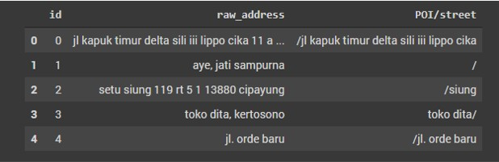
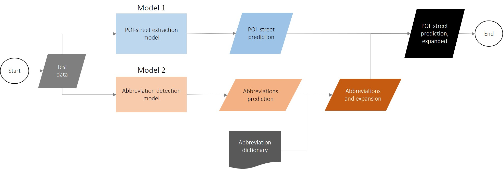

# Address Element Extraction

In this project, we aim to share the approach which our team took that got us into the top 4% on the leaderboard of the Shopee Code League 2021: Address Element Extraction competition. The result can be found [here](https://www.kaggle.com/vincenttzc/competitions).

The team consists of:

- Alvin Lee | [LinkedIn](https://www.linkedin.com/in/alvin-l-00b9a026/)
- Mengyong Lee | [LinkedIn](https://www.linkedin.com/in/mylee1/) | [Github](https://github.com/mylee16)
- Zi Yi Ewe | [LinkedIn](https://www.linkedin.com/in/zi-yi-ewe/)
- Vincent Tan | [LinkedIn](https://www.linkedin.com/in/vincenttzc/) | [Github](https://github.com/vincenttzc)

## Table of contents

1. [Usage](#usage)
1. [Competition task](#competition-task)
1. [Data](#data)
1. [Challenges](#challenges)
1. [Approach](#approach)
   - [Overview](#overview)
   - [Model 1: POI-street extraction model](#model-1-poi-street-extraction-model)
   - [Model 2: Abbreviation detection model](#model-2-abbreviation-detection-model)
1. [Areas for improvement](#areas-for-improvement)
1. [Reference](#reference)

## Usage

The code used was created in Jupyter Notebook for ease of understanding the implementation.

This README file describes the approach for solving the problem. For a more detailed understanding of the implementation, please refer to the Jupyter notebooks in the notebook folder.

If you wish to replicate the environment locally to run the notebook, you can install the packages in the `requirements.txt`

```
pip install -r requirements.txt
```

## Competition task

The competition link can be found [here](https://www.kaggle.com/c/scl-2021-ds/overview).

In this competition, we are provided with addresses in Bahasa Indonesia language and are tasked to extract the Point of Interest (POI) and street names from the unformatted Indonesian address.

## Data

We are provided with 300k raw address with their POI and street labels. We are tasked to predict the POI and street of 50k raw addresses.

<p align="center">
  
  <br>
  <i>Preview of data</i>
</p>

The raw address can be found in the `raw_address` column. POI and street can be found in the `POI/street` column. The words before `/` are the POI while words after `/` are the street.

## Challenges

The task of identifying the POI and streets is made more difficult due to the following:

1. ~20% of the addresses contains abbreviations
   - This meant that to accurately identify the POI and street, we would need to be able to expand the abbreviation to their original form
1. Majority of the abbreviation have more than one expanded word
   - This meant that unless we have a probabilistic way of determining the original word for each abbreviation, we won't be able to accurately expand the abbreviation to their original word for all cases.
1. ~10% of the raw address did not contain POI and street
   - We are not familiar with Indonesian language so we could not tell if the POI and street labels are indeed misssing or if they are wrongly labelled
1. Address consists of nouns and contains few words
   - This means that the words have not much meaning to it- i,e there is no contextual meaning in the raw addresses, which limits the effectiveness of contextual embeddings
   - There are too many unique words - so using traditional bag of words method will result in a highly sparse matrix.

## Approach

#### POI-street extraction model

The first thing my team did was to define the nature of the NLP task. After discussing, we decided to frame this task as a token classification task, a more generic form of Named Entity Recognition.

By framing it this way, we want our model to be able to tell us: For each token if it belong to POI/ street/ other category. Based on this classification, this will then allow us to piece the POI and streets together. Tokens will be defined by the pretrained tokenizer that we will using.

#### Abbreviation detection model

As there is a complication of having abbreviations in the raw addresses, we will need to find some way to expand them.

We initially tried using pure rule based method to expand the abbreviation. This involved mapping abbreviations to their original words in the training data to create an abbreviation dictionary. Next, we applied this expansion to all the abbreviations that it can find in the validation data. The precision of this technique was very bad because many abbreviations are legitimate words which do not need to be expanded. This meant that we needed to selectively expand the abbreviations.

Therefore, we decided to create a second NLP token classification task of identifying tokens that are abbreivations. For each token, we want the model to tell us if it is/ is not an abbreviation. Tokens will also be defined by the pretrained tokenizer that we will using. For those token defined as abbreviation, we will then see if there is an expanded form in the abbreviation dictionary we have created from the training data. If there is, we will expand it, else keep it the same.

## Overview

The diagram below illustrates the overview of our approach.

<p align="center">
  
  <br>
  <i>Overview of approach</i>
</p>

The POI-street extraction model will predict the POI and street tokens from the test data and we will then piece them together.

The abbreviation detection will predict the abbreviation tokens from the test data. This prediction will then be used with the abbreviation dictionary to find out the original words.

The abbreviations and expansion will then be applied on the POI street prediction to expand the abbreviations into the original word.

The models can be trained in a simple manner using Huggingface `Trainer` API. You can refer to [this](https://towardsdatascience.com/fine-tuning-pretrained-nlp-models-with-huggingfaces-trainer-6326a4456e7b) article on a simple example of how to use it.

### Model 1: POI-street extraction model

The following describes the high level approach for training a POI-street extraction model. For a more detailed implementation, feel free to refer to the Jupyter notebooks

1. Select pretrained model
   - IndoBERT was chosen as we needed a pretrained model that is trained on Bahasa Indonesia corpus
1. Prepare labels
   - Split the raw addresses into tokens using IndoBERT's pretrained tokenizer
   - Label if token is POI/ street/ others
1. Split into train and validation set
1. Fine-tune pretrained model on the training set.
   - This is a token classification task, so our model will need to output 3 values for each token, 1 for each category.
   - Validation set was used for early stopping to prevent overfitting
1. Evaluate model performance on the validation set
1. Use fine-tuned model to predict on test set

### Model 2: Abbreviation detection model

The following describes the high level approach for training a abbreviation detection model. For a more detailed implementation, feel free to refer to the Jupyter notebooks

1. Select pretrained model
   - IndoBERT was selected as we needed a pretrained model that is trained on Bahasa Indonesia corpus
1. Prepare labels
   - Split the raw addresses into tokens using IndoBERT's pretrained tokenizer
   - Label if token is abbreviation or not abbeviation
1. Split into train and validation set
1. Using the training data, create an abbreviation dictionary.
   - For words that appear in raw addresses but not in the POI/street column, these are identified as abbreviation
   - Find the word in the POI/street column that is most similar to the abbreviation. This word is the original form.
   - Repeat this process to find abbreviations in the entire training set
1. Fine-tune pretrained model on the training set.
   - This is a token classification task, so our model will need to output 2 values for each token, 1 for each category.
   - Validation set was used for early stopping to prevent overfitting
1. Evaluate model performance on the validation set
1. Use fine-tuned model to predict on test set
1. For abbreviations detected by model in test set, find the expanded form using the abbreviation dictionary
1. Apply this expansion to the prediction of model 1: POI/street model

# Areas for improvement

1. As each abbreviation can be mapped to multiple expansion from the training data, we decided to pick the expansion with the highest frequency to convert the abbreviation in the test data.
   - We could have find ways to determine the most suitable expansion for each abbreviation in a more probablistic manner, perhaps by considering the surrounding words
   - We might consider using noisy channel model to determine the most suitable abbreviation
1. We could have performed ensembling to improve our model performance.
   - We could explore different pretrained models that are trained on Bahasa Indonesia corpus
   - Then combine each individual model's prediction to obtain the final prediction

# Reference

- [Huggingface Transformers](https://huggingface.co/transformers/)
